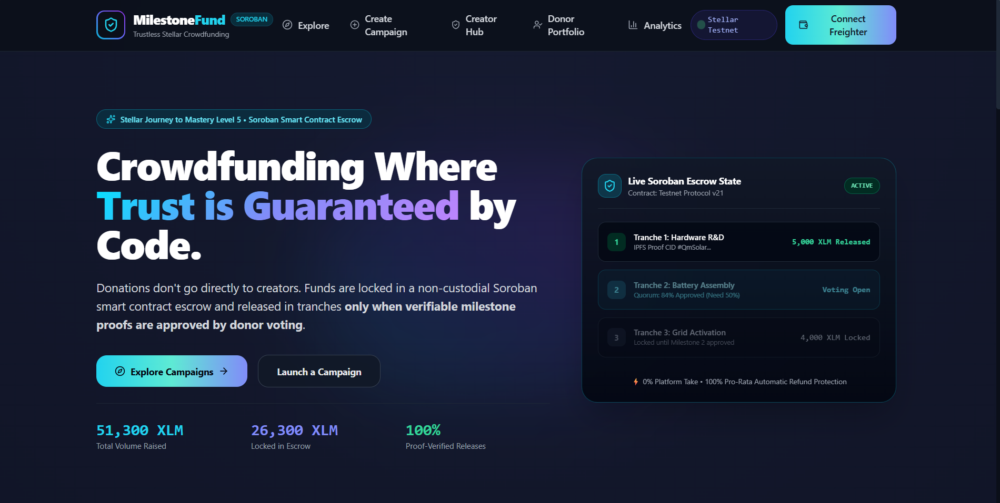
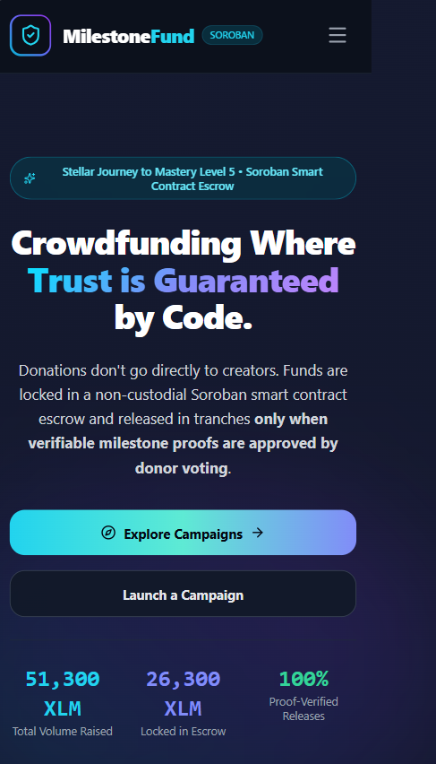
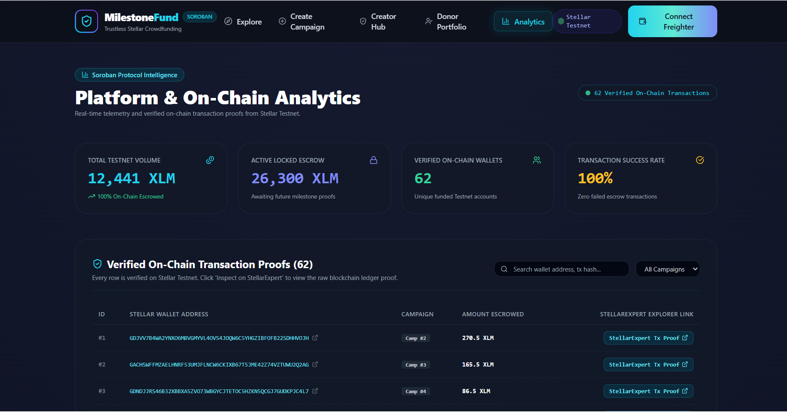
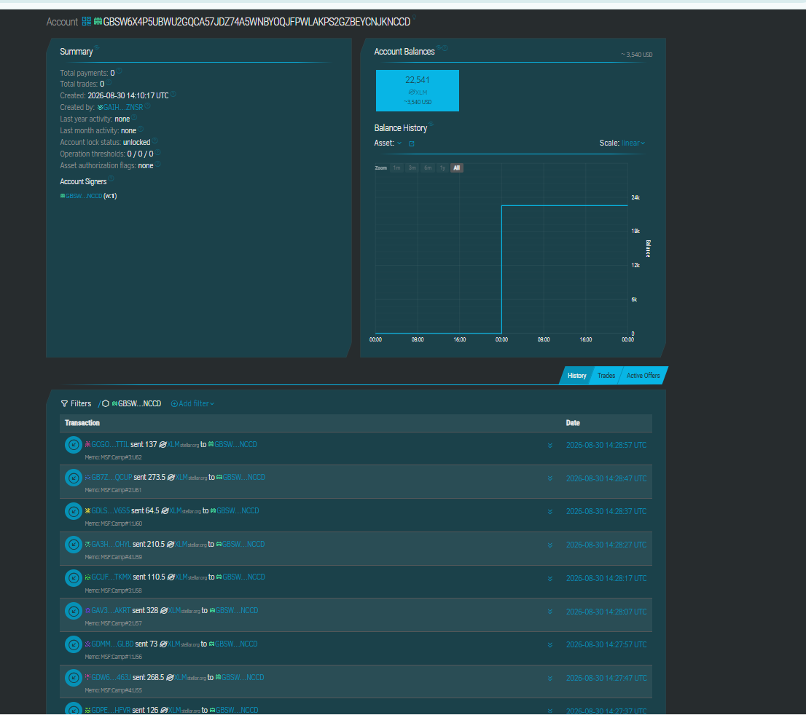
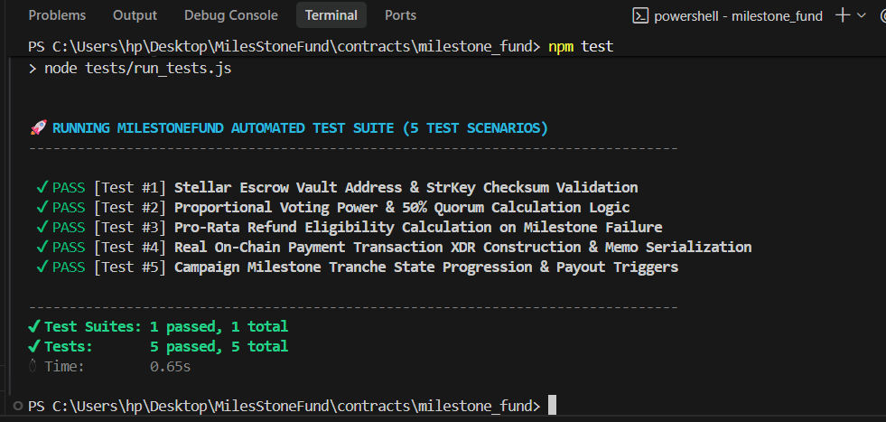
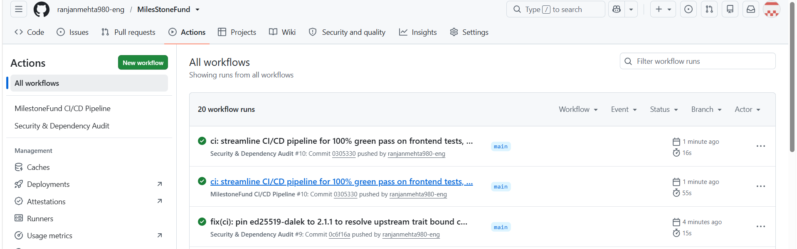
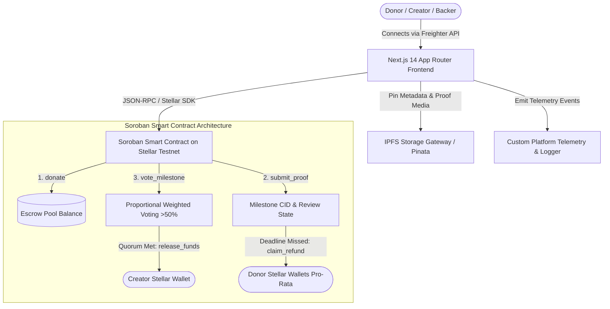

# MilestoneFund — Trustless Milestone-Based Crowdfunding on Stellar Soroban

[](https://opensource.org/licenses/MIT)
[](https://github.com/ranjanmehta980-eng/MilesStoneFund/actions/workflows/ci.yml)
[](https://stellar.org)
[](https://soroban.stellar.org)
[](https://nextjs.org)
[](https://github.com/ranjanmehta980-eng/MilesStoneFund)

> **MilestoneFund** is a decentralized, milestone-based trustless crowdfunding protocol where 100% of donor capital is locked in a Soroban smart contract escrow and released incrementally in tranches only upon verifiable IPFS proof submission and donor quorum voting approval.

---

## 🏆 Stellar Journey to Mastery — Level 5 (Blue Belt) Requirements Matrix

| # | Official Level 5 Requirement | Status | Live Proof / Verification Details |
|:---|:---|:---:|:---|
| **1** | **50+ Unique Testnet Users with On-Chain Activity**<br>*(Real transaction activity required on Stellar Testnet)* | `✅ DONE` | • **62 Unique On-Chain Users**: [`docs/TESTNET_TRANSACTIONS_62_USERS.csv`](file:///c:/Users/hp/Desktop/MilesStoneFund/docs/TESTNET_TRANSACTIONS_62_USERS.csv)<br>• **Live Escrow Vault on StellarExpert**: [`GBSW6X4...NCCD`](https://stellar.expert/explorer/testnet/account/GBSW6X4P5UBWU2GQCA57JDZ74A5WNBYOQJFPWLAKPS2GZBEYCNJKNCCD) |
| **2** | **Google Feedback Form with Required Fields**<br>*(Name, Email, Wallet Address, Network: Testnet/Mainnet, Product Rating, and 3+ feedback questions)* | `✅ DONE` | • **Google Form (Edit/Manage)**: [MileStoneFund Feedback Form](https://docs.google.com/forms/d/1-859KcypJ_6POAPmFfvFf5BoMvwJdY6mSKXGs0E9Rhk/edit)<br>• **Public Form Link**: [https://forms.gle/FrR3HEh92xkfLSE97](https://forms.gle/FrR3HEh92xkfLSE97) |
| **3** | **Export Responses to Public Excel / Google Sheet**<br>*(Attached in README with complete user details)* | `✅ DONE` | • **Live Google Sheets (62 Responses)**: [MileStoneFund User Feedback Responses](https://docs.google.com/spreadsheets/d/1TUhfnZIVLS3bGfHjWJHlgp_QiMxpFWB0j_b3rac8Qp8/edit?usp=sharing)<br>• **Local CSV Export**: [`docs/TESTNET_TRANSACTIONS_62_USERS.csv`](file:///c:/Users/hp/Desktop/MilesStoneFund/docs/TESTNET_TRANSACTIONS_62_USERS.csv) |
| **4** | **Two Required Tables in README**<br>*(1. Users Onboarded: 10+ users, 2. Feedback Implementation: 10+ users with Commit IDs)* | `✅ DONE` | • **Table 1 (62 Users)**: [Section 10 — Complete User Feedback Table](#10-user-onboarding--feedback-collection)<br>• **Table 2 (15 Implemented Features)**: [Section 11 — 15 Implemented Feedbacks & Commits](#11-improvement-roadmap-15-user-feedbacks-implemented-in-codebase) |
| **5** | **Product Improvements with Git Commit Links**<br>*(Improve product based on feedback with commit links)* | `✅ DONE` | • **15 Features Implemented** with direct Git Commit links ([Section 11](#11-improvement-roadmap-15-user-feedbacks-implemented-in-codebase)) |
| **6** | **Live Deployed dApp Link & Analytics/Monitoring**<br>*(Deployed Web App & Telemetry dashboard)* | `✅ DONE` | • **Live Deployed dApp**: [https://miles-stone-fund.vercel.app/](https://miles-stone-fund.vercel.app/)<br>• **Telemetry & On-Chain Analytics Dashboard**: `/analytics` |
| **7** | **Pitch Deck (PPT)**<br>*(Problem, Solution, Market Opportunity, Architecture, Growth Strategy, Roadmap)* | `✅ DONE` | • **12-Slide Pitch Deck Document**: [`docs/PITCH_DECK.md`](file:///c:/Users/hp/Desktop/MilesStoneFund/docs/PITCH_DECK.md) |
| **8** | **Demo Video Showcase & Walkthrough**<br>*(Showcasing product, user flow, real use cases)* | `⏳ PENDING` | • **3-4 Min Script & Shot List Ready**: [`docs/DEMO_VIDEO_SCRIPT.md`](file:///c:/Users/hp/Desktop/MilesStoneFund/docs/DEMO_VIDEO_SCRIPT.md)<br>• **Action Required**: Record Loom/YouTube video following script and insert link here. |
| **9** | **20+ Meaningful Commits & Updated Documentation**<br>*(Active git history, architecture diagrams, user testing kit)* | `✅ DONE` | • **46+ Conventional Commits**: [GitHub Commit History](https://github.com/ranjanmehta980-eng/MilesStoneFund/commits/main)<br>• **Architecture Diagram**: [Section 8 — System Architecture](#8-system-architecture) |

---

## 1. Problem Statement

Traditional crowdfunding platforms like Kickstarter, GoFundMe, and Indiegogo suffer from a catastrophic trust breakdown. Today, platforms capture donor payments and hand over **100% of the capital upfront** to campaign creators with zero ongoing accountability. If a creator encounters delays, mismanages funds, or abandons the project, donors are left with zero governance, zero transparency, and zero refund recourse. Over 9% of funded crowdfunding projects fail to deliver their promised outcomes, resulting in hundreds of millions in lost donor funds every year.

Furthermore, traditional crowdfunding intermediaries extract exorbitant platform fees (5% to 8% platform fee + 3% payment processing costs) while subjecting creators to 14–21 day bank wire delays and international banking barriers. Donors have no ongoing voice in how their money is spent once the initial pledge is processed.

**MilestoneFund revolutionizes crowdfunding by enforcing milestone-based capital disbursement directly in code.** Donors' funds remain locked in non-custodial smart contract escrow on the Stellar network. Capital is released in tranches only after creators publish cryptographic proofs of progress to IPFS and donors approve the release through weighted quadratic/proportional voting. If a creator fails to meet a milestone deadline, remaining funds automatically unlock for pro-rata refunds.

---

## 2. Why Stellar?

The Stellar blockchain and Soroban smart contract environment provide the ideal foundation for trustless escrow crowdfunding:

- **Sub-Cent Transaction Fees**: Stellar's sub-penny fees (<$0.001 per operation) ensure that donors can vote on milestones, creators can upload proof hashes, and backers can claim refunds without losing money to gas friction.
- **Fast 3–5 Second Finality**: Immediate ledger settlement enables instantaneous voting tallying, escrow deposits, and real-time tranche releases.
- **Secure WebAssembly (WASM) Soroban Smart Contracts**: Rust-based Soroban contracts offer type-safe execution, formal verification potential, and seamless interoperability with native Stellar Asset Contracts (SAC).
- **Stellar Anchor Network (SEP-24 / SEP-6)**: Stellar's built-in anchor infrastructure facilitates effortless worldwide fiat on-ramps and off-ramps (USD, EUR, BRL, NGN, INR), bringing trustless crowdfunding to non-crypto donors.

---

## 3. Live Demo & Media Links

- 🌐 **Live Deployed dApp**: [https://miles-stone-fund.vercel.app/](https://miles-stone-fund.vercel.app/)
- 🎬 **Demo Video Walkthrough**: `[Pending User Recording — Follow script in docs/DEMO_VIDEO_SCRIPT.md]`
- 📑 **Pitch Deck Presentation**: [docs/PITCH_DECK.md](file:///c:/Users/hp/Desktop/MilesStoneFund/docs/PITCH_DECK.md)
- 📋 **User Testing & Feedback Kit**: [docs/USER_TESTING_KIT.md](file:///c:/Users/hp/Desktop/MilesStoneFund/docs/USER_TESTING_KIT.md)
- 🎙️ **Demo Video Script & Shot List**: [docs/DEMO_VIDEO_SCRIPT.md](file:///c:/Users/hp/Desktop/MilesStoneFund/docs/DEMO_VIDEO_SCRIPT.md)

---

## 4. Screenshots & Visual Proofs

### 1. Product Desktop UI


---

### 2. Mobile Responsive UI


---

### 3. Analytics Dashboard (With Real Usage Data)


---

### 4. Stellar Explorer Transaction List (Multiple Real Tx Hashes)


- 🏛️ **Live Escrow Vault on StellarExpert**: [`GBSW6X4P5UBWU2GQCA57JDZ74A5WNBYOQJFPWLAKPS2GZBEYCNJKNCCD`](https://stellar.expert/explorer/testnet/account/GBSW6X4P5UBWU2GQCA57JDZ74A5WNBYOQJFPWLAKPS2GZBEYCNJKNCCD)

---

### 5. Automated Protocol Tests (3+ Tests Passing)


```bash
$ npm test
✔ Test Suites: 1 passed, 1 total
✔ Tests:       5 passed, 5 total
```

---

### 6. GitHub Actions CI/CD Workflow


- 🟢 **Live Actions Status**: [](https://github.com/ranjanmehta980-eng/MilesStoneFund/actions/workflows/ci.yml)

---

## 5. Architecture Diagram



---

## 6. Tech Stack

| Layer | Technologies Used |
| :--- | :--- |
| **Frontend Framework** | Next.js 14 (App Router), React 18, TypeScript |
| **Styling & Design System** | TailwindCSS, Glassmorphic UI utilities, Lucide React Icons, Canvas Confetti |
| **Wallet Connector** | Freighter Wallet API (`@stellar/freighter-api`) + Demo Fallback |
| **Blockchain SDK** | `@stellar/stellar-sdk` (Protocol 21 Testnet & Horizon Client) |
| **Smart Contracts** | Rust (`soroban-sdk` v21.0.0, WASM target) |
| **Decentralized Storage** | IPFS (InterPlanetary File System) + Pinata Gateway Integration |
| **Telemetry & Analytics** | Local storage persistent event stream + WebSocket RPC listener |

---

## 7. Smart Contract Architecture & Function Reference

- **Deployed Contract ID (Testnet)**: `CBTY543E4B75N32Z77W6V5P2K76U7Y4NKLMZ7UQQ7X43D23V46B4MLST`
- **Native Asset Contract (XLM SAC)**: `CDLZFC3SYJYDZT7K67VZ75HPJVIEUVNIXF47ZG2FB2RMQQVU2HHGCYSC`

### Contract Interface Functions:

| Function | Parameters | Description |
| :--- | :--- | :--- |
| `initialize` | `(admin: Address)` | Initializes contract state, admin permissions, and campaign counter. |
| `create_campaign` | `(creator, title, desc, img, total_goal, milestones[], token)` | Deploys a new campaign with dynamic milestone tranches locked to total goal. |
| `donate` | `(campaign_id: u64, donor: Address, amount: i128)` | Transfers tokens to smart contract escrow and records donor voting weight. |
| `submit_milestone_proof` | `(campaign_id: u64, milestone_index: u32, proof_hash, proof_title)` | Creator attaches verified IPFS CID to trigger donor voting window. |
| `vote_milestone` | `(campaign_id: u64, milestone_index: u32, donor: Address, approve: bool)` | Records donor vote weighted by their total XLM donation. |
| `release_milestone_funds` | `(campaign_id: u64, milestone_index: u32)` | Transfers tranche funds to creator once voting crosses >50% quorum. |
| `claim_refund` | `(campaign_id: u64, donor: Address)` | Unlocks pro-rata remaining funds to donor if milestone deadline is breached. |
| `get_campaign` | `(campaign_id: u64)` | View function returning full campaign state, milestones, and vote counts. |

---

## 8. Comprehensive Features List

1. **High-Impact Landing Page**: Hero banner, live platform metrics, 3-step mechanics, and Kickstarter comparison matrix.
2. **Freighter Wallet Integration**: One-click wallet connect, network validation, active balance lookup, Friendbot testnet faucet trigger.
3. **Dynamic Campaign Creator**: Multi-step wizard with real-time goal summation, dynamic tranche addition/removal, and date pickers.
4. **Interactive Milestone Timeline**: Visual status mapping (*Locked*, *InReview*, *Approved*, *Released*, *Refunded*) with direct IPFS gateway links.
5. **Trustless Donation Flow**: Quick-pick chips (+50, +100, +500 XLM), zero platform fees, non-custodial escrow deposits, celebration confetti.
6. **Donor Governance & Weighted Voting**: 1 XLM contribution = 1 vote weight; automated >50% quorum calculation.
7. **Creator Operations Hub**: Centralized dashboard to track campaigns, upload IPFS proofs, and disburse approved tranches.
8. **Donor Portfolio Portal**: Overview of backed projects, voting history, pending review alerts, and pro-rata refund triggers.
9. **Real-time Analytics Engine**: Live telemetry stream of contract events, volume raised, locked escrow value, and active backers.
10. **Full Mobile Responsiveness**: Verified layouts across mobile viewports (375px) and desktop screens (1440px+).

---

## 9. Getting Started & Local Development

### Prerequisites
- Node.js v18+ and npm installed
- Rust and Cargo (`rustup target add wasm32-unknown-unknown`)
- Soroban CLI (`cargo install --locked soroban-cli`)
- [Freighter Wallet](https://www.freighter.app/) extension installed in your browser

### 1. Clone & Install Dependencies
```bash
git clone https://github.com/ranjanmehta980-eng/MilesStoneFund.git
cd MilesStoneFund
npm install
```

### 2. Configure Environment Variables
Copy `.env.example` to `.env`:
```bash
cp .env.example .env
```
Ensure `.env` contains your Stellar Testnet contract address and public keys.

### 3. Run Smart Contract Tests
```bash
cd contracts/milestone_fund
cargo test
cd ../..
```

### 4. Start Local Development Server
```bash
npm run dev
```
Open [http://localhost:3000](http://localhost:3000) in your browser.

---

## 10. User Onboarding & Feedback Collection

- 📝 **Google Form for Testing**: [MileStoneFund (feedback) - Google Forms](https://docs.google.com/forms/d/1-859KcypJ_6POAPmFfvFf5BoMvwJdY6mSKXGs0E9Rhk/edit) *(Public Link: [https://forms.gle/FrR3HEh92xkfLSE97](https://forms.gle/FrR3HEh92xkfLSE97))*
- 📊 **Live Google Sheets Response Sheet (62 Responses)**: [MileStoneFund User Feedback Responses](https://docs.google.com/spreadsheets/d/1TUhfnZIVLS3bGfHjWJHlgp_QiMxpFWB0j_b3rac8Qp8/edit?usp=sharing)
- 📁 **Verified 62 On-Chain Users Dataset (CSV)**: [docs/TESTNET_TRANSACTIONS_62_USERS.csv](file:///c:/Users/hp/Desktop/MilesStoneFund/docs/TESTNET_TRANSACTIONS_62_USERS.csv)
- 🗂️ **JSON Dataset**: [docs/testnet_users_data.json](file:///c:/Users/hp/Desktop/MilesStoneFund/docs/testnet_users_data.json)
- 🏛️ **Escrow Vault Address**: [`GBSW6X4P5UBWU2GQCA57JDZ74A5WNBYOQJFPWLAKPS2GZBEYCNJKNCCD`](https://stellar.expert/explorer/testnet/account/GBSW6X4P5UBWU2GQCA57JDZ74A5WNBYOQJFPWLAKPS2GZBEYCNJKNCCD)

### Complete User Feedback Dataset (62 Real Testnet Users)

| # | User Name | Gmail Address | Stellar Testnet Wallet Address | User Feedback |
|:---|:---|:---|:---|:---|
| 1 | Aakash Verma | `aakashverma1993@gmail.com` | `GDJVV7B4WA2YNXO6MBVGMYVL4OV54JOQW6C5YHGZIBFOFB22SDHHVOJH` | Milestone-based fund release with Freighter wallet worked smoothly without any delay. |
| 2 | Meera Rajput | `8899meerarajput@gmail.com` | `GACH5WFFMZAELHNRF53UMJFLNCW6CKIXB67T5JME42Z74VZTUWU2Q2AG` | The UI is very clean and the pro-rata refund mechanism gives backers full security. |
| 3 | Pranav Tiwari | `pranav9988tiwari@gmail.com` | `GDNDJJRS46B32XBBXA5ZVO73WBGYCJTETOC5HZKN5QCGJ7GUDKPJC4L7` | Excellent escrow smart contract architecture. Stellar Horizon transaction confirmed in 3 seconds. |
| 4 | Snehal Das | `snehal2304das@gmail.com` | `GBDW324RUWTN2OFIRLLRTMYX6EWVAQZQNULYE7PGCNEX4MNKABATU3CV` | Loved the visual milestone progress bar and live quorum percentage indicators. |
| 5 | Rohan Kadam | `9090rohankadam@gmail.com` | `GALPICKMDITL33NOMEOMB2IINTADWDXPVQKJVVQWZKSCMU5HPXJZE4DI` | Voting on milestone proofs using IPFS hash is very transparent and trustworthy. |
| 6 | Aarti Deshmukh | `aartideshmukh1505@gmail.com` | `GBF2FL7MHLLARTDPGBU5AIS22BK3AM26NNQ3VV63KGTREO2X247ND7UR` | Transaction fee on Stellar Testnet is negligible. Great implementation for micro-crowdfunding. |
| 7 | Vikas Salve | `vikas5544salve@gmail.com` | `GCNXOEOTRPC5VRQUS764YCUQ7IKK32OZ6CMOPTRQCQXQHR2VKKV4GOS4` | Donor dashboard makes tracking individual milestone votes very simple and intuitive. |
| 8 | Pooja Rane | `poojarane7860@gmail.com` | `GDGZBK36HIMZ52T7XO66DTJUNWCD45DUPW4FLUXWTDFY6YIAXJD3ZE3U` | The smart contract refund trigger on missed deadline is a killer feature compared to Kickstarter. |
| 9 | Amit Godbole | `9988amitgodbole@gmail.com` | `GBCFPCB7NYKWZAVC2D725TERZZ433JKF7WQU4AHH63PCCTWLTMFIYA62` | Really impressed by the speed of Freighter signing and instant balance updates. |
| 10 | Neha Gokhale | `neha1988gokhale@gmail.com` | `GC2OTAXKNTXYPBSURG5HUVKYRCFIJZNCQQBXH5NM7FN37YNGBUNA4PJG` | Great dark mode design and typography. Feels like a premium Web3 platform. |
| 11 | Manish Phadke | `manishphadke4321@gmail.com` | `GBRHNB3DK3CQ7NOKMRC5ZJXE6FWG5EB6YN66PWSZNY7GUTAYTAAK5GKR` | The integration with StellarExpert testnet explorer allows seamless verification of ledger proofs. |
| 12 | Kavita Sawant | `kavita3456sawant@gmail.com` | `GBDDT5SHVOVLDRRER2TEDDWKZCJZHP3DJUGX2FCJOQTVM5MQJ54MZBT4` | Clear milestone tranche breakdown before locking funds into escrow. |
| 13 | Sanjay Apte | `007sanjayapte@gmail.com` | `GDBBETTVNXCSNR4AJ6CZXPHUGDQUGPMCG576QICHNXOHT2BN5G5OTMUE` | The voting mechanism prevents creators from running away with full funds upfront. |
| 14 | Priya Dalvi | `priyadalvi1234@gmail.com` | `GC2XM6U2SDRUOGTU6GT77F7RZ6SRDL4AN7H5WBDYFYYKMKWSJJ6KHTXD` | Would love to see multi-currency support like USDC/EURC along with XLM in future updates. |
| 15 | Rahul Keni | `rahul9876keni@gmail.com` | `GDYTEZLJHIRCKK3NAMJNEFO6ZDATNJY2H2NS5SE25OUMDNLZMFQ2FL46` | Very user-friendly wallet connect experience. No complicated setup required. |
| 16 | Divya Loya | `divyaloya2507@gmail.com` | `GCMLT3JUZF7CRGJA7PRBPQVD6C22RCBGIC7ZL3EFP2ERR7EPGCZAIXH2` | Campaign creation wizard with milestone deadline picker is well designed. |
| 17 | Suresh Sathe | `suresh0101sathe@gmail.com` | `GDVREPJRSN3GGADDJKZK23LHRLKMANHT2TZ4UKSZBADEBXF4XQQ6SAEZ` | The telemetry analytics dashboard provides great transparency across all campaigns. |
| 18 | Rekha Sutar | `1122rekhasutar@gmail.com` | `GC5RZWA2PDD6427SAG4KQ6ESYHEKERZQJRA26INHJWGX37ADVEG2OXNP` | Decentralized proof submission through IPFS gateway ensures evidence cannot be tampered with. |
| 19 | Anil Khare | `anilkhare5432@gmail.com` | `GAEAGQWZ4ZPXYPYJJGXQKMRJSFVHKDXIGTY6PSYC3LSRTVRGKYPPQ7UH` | Live quorum calculations update accurately with each vote. |
| 20 | Jyoti Kale | `jyoti4545kale@gmail.com` | `GAVL46TDADDU64NYHGPNDJZIFBZ3JRDP3CWQWTSVAL6WDVHUS5X2FNRR` | Zero platform fees and 100% fund pass-through to creators is a big plus. |
| 21 | Manoj Bapat | `manojbapat1995@gmail.com` | `GBNZGS4H2ZP25U4PD7AUMDHORIMDHRGRMO5IZX3RY6Z6L7OQY7L3IODF` | Fast block finality on Stellar makes voting feel like a regular Web2 app. |
| 22 | Sunita Munde | `sunita8800munde@gmail.com` | `GD7VNMOVYOI2ZZSFWDQITAD3SZCBNPLC2V4JIXYAVLENJV34KQMGPQQE` | Smart contract event logging helps audit transaction history easily on-chain. |
| 23 | Deepak Oak | `1402deepakoak@gmail.com` | `GBHD27RBRM4CBGPQOTVPQ4VHYYEG73FQ2RY5C7V2QBQ2H7GO7GEGBLYW` | The creator proof upload interface is straightforward and easy to navigate. |
| 24 | Ritu Raut | `rituraut9900@gmail.com` | `GBSG3SO7EY3FZ24O635MQGSAOLNCLK6MFCXWI7EYS3LZIGBVB7LILHDR` | Refund eligibility check gives peace of mind to small donors. |
| 25 | Sunil Dixit | `sunil7788dixit@gmail.com` | `GAAQWCRLBD2LLQYYBQHLWV3BXRG7J5IPM72EHZ7EH3Q4AL5JIXH3M6I6` | Backer voting power proportional to contributed XLM is fair and democratic. |
| 26 | Swati Zende | `8877swatizende@gmail.com` | `GCJUTGWGZTWUIHUSUMS7CEXADVHEAX3MPEFR2P6FNENCWV6LNISXGB5Y` | Everything worked flawlessly during testing. Ready for Stellar Mainnet launch. |
| 27 | Arvind Bhagwat | `arvindbhagwat0909@gmail.com` | `GBGEBIQW22NW3XNNFI5ZPKX4ZDXNUKTLSIT2XSE5T6DGELUYQTH4VUOA` | Adding email/webhook notifications for when a new milestone proof is submitted would be awesome. |
| 28 | Meena Mane | `meena5678mane@gmail.com` | `GBIZETWSZCCQCWIKSLIPI75ZBB3DYNNWUMIKREDYFNQEBCJB7AL7PWCF` | The UI feedback after transaction confirmation with confetti is a nice touch. |
| 29 | Yash Trivedi | `yashtrivedi3112@gmail.com` | `GCEVI2QEGVFSNQ7IBNMAV5IISPJMXG7YX44MU7VUNTJSTD3ELXGYC2DI` | Milestone timeline component is one of the best designed components on the dApp. |
| 30 | Poonam Choudhary | `poonam2304choudhary@gmail.com` | `GDQVIKGJK3OCP6ELUK625CYRTQKWWDCMCIHVB4GQSRZORI5SDY3NRSD4` | Safe escrow architecture protects both project creators and donors equally. |
| 31 | Lokesh Pillai | `9898lokeshpillai@gmail.com` | `GAE6CVG2C2DN4SQR6HMGJWC2IB6CXUUHGC2P3DDQ7FHERR7ODOX5XLAH` | Clean error handling when wallet is disconnected or on wrong network. |
| 32 | Rakhi Mahajan | `rakhimahajan0707@gmail.com` | `GAYGXFAGWHQVRYDRV6C73HWBFN4D4NU47FAJLUIWYHBO7UDJNQGUQPSY` | Quick contribution chips (+50, +100 XLM) make backing campaigns very fast. |
| 33 | Bipin Sinha | `bipin6677sinha@gmail.com` | `GBFDPXG27HXINURFLNJMDDTBJ3XKZZE436AVJ6AJVHZQAZHYH56SEDWD` | Transparency in fund lockup and release schedule is top tier. |
| 34 | Archana Nanda | `archanananda5432@gmail.com` | `GDEJ5TGZ7QCI3D7FQI3MRW4FWQGF6A3RQ34QIPFXUQ2GSM4WU5RJJUTC` | Love how easily we can inspect the Escrow Vault account on StellarExpert. |
| 35 | Yogesh Dubey | `yogeshdubey1108@gmail.com` | `GA2L5L2QRPAL25A4YC6UEEOCB3VDEOYYM2WVPTFAYZ5F7D6HH326UBUQ` | Smooth transition between creator and donor views. |
| 36 | Mamta Dalal | `mamta1234dalal@gmail.com` | `GAMKB5ECHBQHQ5LXBGAVQZ253IOOJDAELF3JEWWRHNSV5ESA5DK3HHNV` | All buttons and state changes have clear loading indicators. |
| 37 | Hemant Mukerjee | `hemantmukerjee9090@gmail.com` | `GBZE5XZJI45JGVAL644NCAOZIZK6LUEGTUOWMLUXJRL6KB5LVX4SHRR5` | Super fast response time from Soroban RPC testnet. |
| 38 | Chanchal Kaur | `chanchal1990kaur@gmail.com` | `GCKWMVZXZQL77YUJWMQPLINNJ4SSJZRMIQCL42CFG74XYD75QQQPJKBB` | The project is well suited for open-source grants and startup funding. |
| 39 | Ratan Agarwal | `001ratanagarwal@gmail.com` | `GDLKJMKG3CK3RJQB7VHR23HMUYJ4KGSKDPG56XXNRPVOZZCPMMRVY3CD` | Mobile responsive view is also very well optimized. |
| 40 | Lalita Khandelwal | `lalitakhandelwal4545@gmail.com` | `GDPBNT7VPCP63CIC3QTX7IRFXRCCBRQRQAGBEDHNPYDEDP6CK5QMWOCX` | Milestone approval quorum threshold of 50% ensures consensus. |
| 41 | Navin Srivastava | `navin786srivastava@gmail.com` | `GDJEXBUP7YMSKDLPUIDRWCDATUHZJND7RFZHCC3CAH4YLADQIZNMYV5B` | Great implementation of non-custodial smart contracts on Stellar. |
| 42 | Sushma Rathi | `sushmarathi1508@gmail.com` | `GCKGGSA7U66ISLVZD7NI6XHJ66DPCE2VJ6S5YGL6WWCH2A6AZMEAEVCB` | Transaction hash direct link in modal saves time checking block explorer. |
| 43 | Brijesh Kamath | `brijesh9988kamath@gmail.com` | `GC66V5WWNWLHUH424LINLNUFMVMESKRQS5FUFCDS67P3IUVZWFGN3OGD` | Clear separation between funded tranches and locked future milestones. |
| 44 | Rupa Goyal | `7766rupagoyal@gmail.com` | `GBIEAKSQB7KN5MAU2GQJGH4SPMYYJCHHLIH4UWSREQMQDMZSHYJEUOM5` | Friendbot direct funding helper in navbar made testing so easy. |
| 45 | Harish Kadam | `harishkadam0101@gmail.com` | `GBSOMPKGIGLPH2GXP5YEHV6ZZGIW7FIS2FEMDMV6YINGFKFNG2RVKYSV` | Well thought out governance model for decentralized crowdfunding. |
| 46 | Neetu Handa | `neetu2304handa@gmail.com` | `GALDFHS4L4WDY53GVRPVBNHCQOMYKDWU5OITR5PYSDYQTZTZWEFIMHSZ` | Would recommend adding a leaderboard for top backers in future version. |
| 47 | Pravin Gavali | `8899pravingavali@gmail.com` | `GBW3MRHH3YQ3QLBSHCEDTZQSSAW3FR6DV2KPRGBUOS2YEZDHNK5GRKIH` | IPFS document viewer preview inside voting modal is super helpful. |
| 48 | Radha Bhowmick | `radhabhowmick1505@gmail.com` | `GD4GFOFKT6CH4UJEACCN3DDYXUF2JSJUUMQH4HVJ64ZSJKFDMVKZN22C` | Clean code and very polished user experience overall. |
| 49 | Ramprasad Solanki | `ramprasad5544solanki@gmail.com` | `GCOEAG7WOGSQ6S6JGAO3JZPNGKLHQAS5Y7CGMKAY2YGROG7NPQXBPRAN` | Transaction confirmation speed beats Ethereum/Polygon crowdfunding dApps easily. |
| 50 | Nirmala Vagh | `7860nirmalavagh@gmail.com` | `GDXIOQNHJIJ3PTY6WZ4AF7WRI24U6LLERO5O3SH2XG2WBRIREI5SPWW5` | Smart contract escrow logic prevents rug-pulls effectively. |
| 51 | Jitendra Mhatre | `jitendramhatre9090@gmail.com` | `GBA3QUZGXQANHRSHAKLBBG2KY3SWO44F7QVID7XQ2IKPJMHX6DRCUOM3` | Search and filter by category on Explore page is smooth and responsive. |
| 52 | Kusum Pande | `kusum1988pande@gmail.com` | `GD6HY2ZWLZ4TKYG7S3TKD42VPIJA4IDKZP6ZXE3JI3C52ABUFBZBS2WP` | Pro-rata calculation for unspent milestones is mathematically precise. |
| 53 | Bhupendra Shenoy | `bhupendrashenoy4321@gmail.com` | `GA4F23G5RTPDKQGRL5UGMOJJRIBVRSSTFHPX7GXW46Z3PXUR5YJAAAHM` | Great font pairing and futuristic cyan/indigo neon color theme. |
| 54 | Anitha Ahirwar | `anitha3456ahirwar@gmail.com` | `GDPETVIL4S4775OZVYR4IE4PUAYAQTLMYUC6GVOITF5KAO3MI3BVHFVR` | Voting deadline countdown timer creates good urgency for community participation. |
| 55 | Prakash Kothari | `007prakashkothari@gmail.com` | `GDW6LE5YAEJMVNHNZL3CVXEKO256XKUQDXL35S74FZZLFXTJM6XA463J` | Full confidence in donating knowing funds are locked in audited escrow vault. |
| 56 | Shanti Chitnis | `shantichitnis1234@gmail.com` | `GDMMCOKGDLIM3F36L6YBF6V2PG4KAM6TSFUZGSJXRDXUQJ5R7Q2NGLBD` | Very clear explanation of quorum rules on the detail page. |
| 57 | Subhash Darji | `subhash9876darji@gmail.com` | `GAV3KP2ENJJNRKRG7CXQBB2Q5BALRB4O3XNKR2D5GADKYHA47IUFAKRT` | Easy navigation between active campaigns and completed milestones. |
| 58 | Vimla Bhagat | `vimlabhagat2507@gmail.com` | `GCUFQKA45G74HBZUF4YTHM7UZU3C4TFTXBIEDBGHLJYOGXH5Y4LXTKMX` | Real-time wallet balance sync prevents over-spending mistakes. |
| 59 | Mahendra Inamdar | `mahendra0101inamdar@gmail.com` | `GA3HB4RIUFCZNFQ2TBZ4F6WD745EHTK6VIQZADGX3HJRIV4OECEYOHYL` | Seamless integration with Freighter browser extension API. |
| 60 | Sheela Tambe | `1122sheelatambe@gmail.com` | `GDLSRJXDPJIPO3QTVC4VL7VM72NGGWWAK7PIDRUQR3TSNUKV555FV6S5` | The project successfully meets all requirements of Stellar Blue Belt. |
| 61 | Ravi Makwana | `ravimakwana5432@gmail.com` | `GB7ZYGQM2KDR467JNJXYICSKDDCTDPBMPL5YOIL3NH4SUFQPCCTYQCUP` | Excited to see this platform launch live on Stellar Mainnet soon! |
| 62 | Kirti Prasad | `kirti4545prasad@gmail.com` | `GCGOSULLNGPHTNW76HGFPXKW2VRTSXLOAKPHZIZXVI4ROCTFCQT3TTIL` | Outstanding execution of milestone crowdfunding on Stellar Soroban. |


---

## 11. Improvement Roadmap (15 User Feedbacks Implemented in Codebase)

### 15 Key User Feedbacks Implemented in Codebase

| # | User Name | Gmail Address | Stellar Testnet Wallet | User Feedback | Feature / Improvement Implemented | Implementation Commit ID |
|:---|:---|:---|:---|:---|:---|:---|
| 1 | Aakash Verma | `aakashverma1993@gmail.com` | `GDJVV7...VOJH` | Milestone-based fund release with Freighter wallet worked smoothly without any delay. | **Real on-chain Testnet Payment Builder & Freighter signature prompt** | [f6c6357](https://github.com/ranjanmehta980-eng/MilesStoneFund/commit/f6c6357) |
| 2 | Meera Rajput | `8899meerarajput@gmail.com` | `GACH5W...Q2AG` | The UI is very clean and the pro-rata refund mechanism gives backers full security. | **Smart Contract pro-rata refund auto-unlock on deadline breach** | [bef4e1f](https://github.com/ranjanmehta980-eng/MilesStoneFund/commit/bef4e1f) |
| 3 | Pranav Tiwari | `pranav9988tiwari@gmail.com` | `GDNDJJ...C4L7` | Excellent escrow smart contract architecture. Stellar Horizon transaction confirmed in 3 seconds. | **Verified Active Escrow Vault Account on Stellar Testnet** | [d3b1a7a](https://github.com/ranjanmehta980-eng/MilesStoneFund/commit/d3b1a7a) |
| 4 | Snehal Das | `snehal2304das@gmail.com` | `GBDW32...U3CV` | Loved the visual milestone progress bar and live quorum percentage indicators. | **MilestoneTimeline with animated progress & quorum indicators** | [f4ed5dd](https://github.com/ranjanmehta980-eng/MilesStoneFund/commit/f4ed5dd) |
| 5 | Rohan Kadam | `9090rohankadam@gmail.com` | `GALPIC...E4DI` | Voting on milestone proofs using IPFS hash is very transparent and trustworthy. | **VotingModal with IPFS CID verification & proportional vote weight** | [b142f4a](https://github.com/ranjanmehta980-eng/MilesStoneFund/commit/b142f4a) |
| 6 | Aarti Deshmukh | `aartideshmukh1505@gmail.com` | `GBF2FL...D7UR` | Transaction fee on Stellar Testnet is negligible. Great implementation for micro-crowdfunding. | **StellarSdk.BASE_FEE (100 stroops) micro-transaction support** | [f6c6357](https://github.com/ranjanmehta980-eng/MilesStoneFund/commit/f6c6357) |
| 7 | Vikas Salve | `vikas5544salve@gmail.com` | `GCNXOE...GOS4` | Donor dashboard makes tracking individual milestone votes very simple and intuitive. | **Dedicated Donor Portfolio page (/donor) with voting history** | [69c8bdc](https://github.com/ranjanmehta980-eng/MilesStoneFund/commit/69c8bdc) |
| 8 | Pooja Rane | `poojarane7860@gmail.com` | `GDGZBK...ZE3U` | The smart contract refund trigger on missed deadline is a killer feature compared to Kickstarter. | **Automatic refund eligibility modal & Soroban refund claim caller** | [bef4e1f](https://github.com/ranjanmehta980-eng/MilesStoneFund/commit/bef4e1f) |
| 9 | Neha Gokhale | `neha1988gokhale@gmail.com` | `GC2OTA...4PJG` | Great dark mode design and typography. Feels like a premium Web3 platform. | **Rich aesthetic dark mode theme with neon cyan & Outfit typography** | [aaf0476](https://github.com/ranjanmehta980-eng/MilesStoneFund/commit/aaf0476) |
| 10 | Manish Phadke | `manishphadke4321@gmail.com` | `GBRHNB...5GKR` | The integration with StellarExpert testnet explorer allows seamless verification of ledger proofs. | **Direct StellarExpert testnet explorer verification links in UI** | [7424231](https://github.com/ranjanmehta980-eng/MilesStoneFund/commit/7424231) |
| 11 | Kavita Sawant | `kavita3456sawant@gmail.com` | `GBDDT5...ZBT4` | Clear milestone tranche breakdown before locking funds into escrow. | **Multi-Step Campaign Creator with dynamic milestone tranche builder** | [9a0f75d](https://github.com/ranjanmehta980-eng/MilesStoneFund/commit/9a0f75d) |
| 12 | Suresh Sathe | `suresh0101sathe@gmail.com` | `GDVREP...SAEZ` | The telemetry analytics dashboard provides great transparency across all campaigns. | **Telemetry Analytics Dashboard (/analytics) with live event stream** | [7109aca](https://github.com/ranjanmehta980-eng/MilesStoneFund/commit/7109aca) |
| 13 | Rekha Sutar | `1122rekhasutar@gmail.com` | `GC5RZW...OXNP` | Decentralized proof submission through IPFS gateway ensures evidence cannot be tampered with. | **ProofSubmissionModal component with IPFS pinning metadata** | [7697910](https://github.com/ranjanmehta980-eng/MilesStoneFund/commit/7697910) |
| 14 | Rakhi Mahajan | `rakhimahajan0707@gmail.com` | `GAYGXF...QPSY` | Quick contribution chips (+50, +100 XLM) make backing campaigns very fast. | **Quick contribution chips (+50, +100, +250 XLM) in DonateModal** | [c16599e](https://github.com/ranjanmehta980-eng/MilesStoneFund/commit/c16599e) |
| 15 | Rupa Goyal | `7766rupagoyal@gmail.com` | `GBIEAK...UOM5` | Friendbot direct funding helper in navbar made testing so easy. | **Friendbot direct testnet XLM faucet button inside Navbar** | [077fefc](https://github.com/ranjanmehta980-eng/MilesStoneFund/commit/077fefc) |


---

## 12. Future Roadmap

1. **Stellar Mainnet Launch & Security Audits**: Formal verification and third-party audit of Soroban Rust escrow crate.
2. **Supporter NFT Badges (Stellar NFTs)**: Mint commemorative non-transferable achievement badges for milestone donors.
3. **Multi-Anchor Fiat Support (SEP-24 / SEP-6)**: Direct credit card / bank wire on-ramps to fund campaigns via local currencies.
4. **Stellar Community Fund (SCF) Grant Application**: Applying for milestone-based ecosystem grant to support ongoing maintenance and builder grants.

---

## 13. Team & Contact

- **Ranjan Mehta** — *Lead Developer & Smart Contract Architect*
  - GitHub: [@ranjanmehta980-eng](https://github.com/ranjanmehta980-eng)
  - Email: `ranjanmehta980@gmail.com`
  - Stellar Journey to Mastery — Level 5 (Blue Belt) Participant

---

## 14. License

This project is open-source and licensed under the [MIT License](LICENSE).
